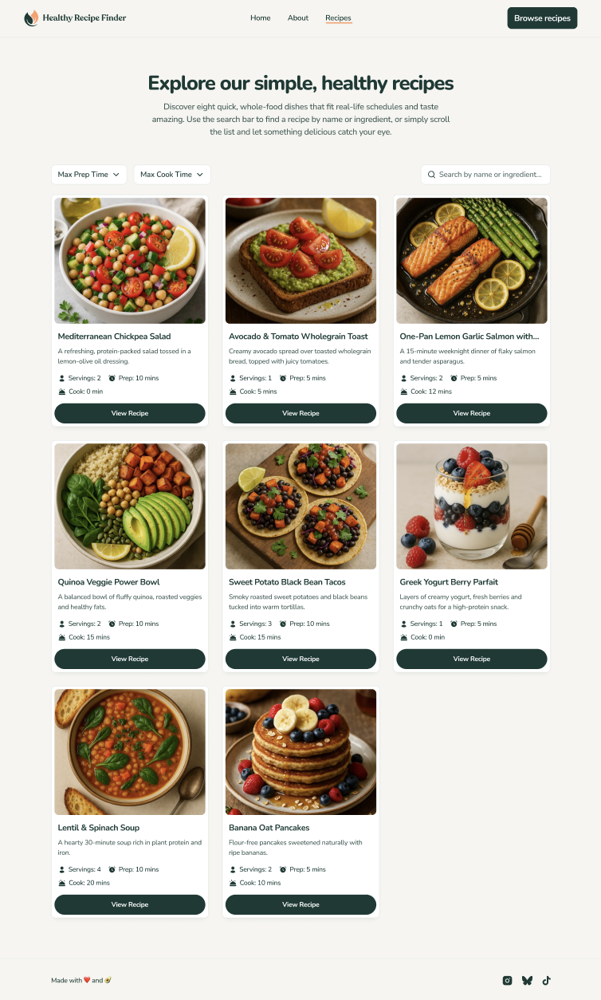

# 🍽️ GreenPlate - Healthy Recipe Finder


## 📱 Preview

<div align="center">

### Desktop View



_Explore simple, healthy recipes that fit real-life schedules_

</div>

## 📖 About The Project

**GreenPlate** is a full-stack web application designed to help users discover quick, wholesome, and delicious recipes. With an intuitive interface and powerful filtering capabilities, users can easily find recipes by name, ingredient, preparation time, or cooking time. The platform features a comprehensive collection of healthy dishes ranging from Mediterranean salads to protein-packed power bowls.

### ✨ Key Features

- 🔍 **Advanced Search** - Search recipes by name or ingredient
- ⏱️ **Smart Filtering** - Filter by max prep time and cook time
- 📊 **Detailed Recipe Info** - Complete nutritional and cooking information
- 🎯 **Recipe Details** - Ingredients, instructions, and serving sizes
- 📱 **100% Responsive** - Fully adaptive design for all devices
- 🗄️ **Database-Driven** - 80% of content dynamically loaded from MongoDB
- ⚡ **Fast Performance** - Optimized loading and smooth user experience
- 🎨 **Clean UI/UX** - Modern, intuitive interface with beautiful food photography

## 🛠️ Built With

### Backend Technologies

- **[Node.js](https://nodejs.org/)** - JavaScript runtime environment
- **[Express.js](https://expressjs.com/)** - Web application framework
- **[MongoDB](https://mongodb.com/)** - NoSQL database for recipe storage
- **[Mongoose](https://mongoosejs.com/)** - MongoDB object modeling

### Frontend Technologies

- **[EJS](https://ejs.co/)** - Embedded JavaScript templating
- **[CSS3](https://developer.mozilla.org/en-US/docs/Web/CSS)** - Modern styling and animations
- **[JavaScript](https://developer.mozilla.org/en-US/docs/Web/JavaScript)** - Client-side interactivity
- **[Responsive Design](https://developer.mozilla.org/en-US/docs/Learn/CSS/CSS_layout/Responsive_Design)** - Mobile-first approach

### Tools & Libraries

- **Body Parser** - Request body parsing middleware
- **Path Module** - File and directory path utilities
- **Custom Middleware** - Route protection and data validation

## 🎯 Features Overview

### 🏠 Home Page

- **Hero Section** - Welcoming introduction with call-to-action
- **Featured Recipes** - Curated selection of popular dishes
- **Quick Navigation** - Easy access to recipe categories
- **Responsive Grid** - Beautiful card-based recipe display

### 🔍 Recipe Browser

- **Dynamic Filtering**
  - Max Preparation Time selector
  - Max Cook Time selector
  - Real-time results update
- **Search Functionality**

  - Search by recipe name
  - Search by ingredients
  - Instant search suggestions

- **Recipe Cards**
  - High-quality food photography
  - Servings and time information
  - Quick recipe preview
  - Direct link to detailed view

### 📄 Recipe Detail Page

- **Complete Information**
  - Full ingredient list with measurements
  - Step-by-step cooking instructions
  - Preparation and cooking times
  - Serving size information
- **Nutritional Data**
  - Calorie information
  - Dietary preferences
  - Allergen information

### 📚 About Page

- **Platform Information** - Learn about GreenPlate's mission
- **Healthy Eating Tips** - Nutritional guidance and advice
- **Recipe Philosophy** - Our approach to healthy cooking

## 🗄️ Database Structure

### Recipe Collection

The MongoDB database includes comprehensive recipe documents with the following structure:

```javascript
{
  name: String,
  description: String,
  image: String,
  servings: Number,
  prepTime: Number,
  cookTime: Number,
  ingredients: [String],
  instructions: [String],
  category: String,
  difficulty: String,
  calories: Number
}
```

### Features

- **Indexed Searches** - Fast query performance
- **Data Validation** - Schema-based validation
- **Scalable Structure** - Easy to expand with new fields

## 🎨 Design Features

### Color Scheme

- **Primary Colors** - Fresh green palette representing healthy eating
- **Accent Colors** - Warm tones for call-to-action elements
- **Neutral Background** - Clean, light background for readability

### Interactive Elements

- **Hover Effects** - Smooth card animations on hover
- **Filter Dropdowns** - Intuitive dropdown selectors
- **Responsive Navigation** - Mobile-friendly menu system
- **Smooth Scrolling** - Fluid page transitions
- **Loading States** - Visual feedback during data fetch

### Typography

- **Modern Fonts** - Clean, readable font families
- **Hierarchical Headings** - Clear content structure
- **Readable Body Text** - Optimized line height and spacing

## 🚀 Getting Started

### Prerequisites

- Node.js (v14 or higher)
- MongoDB (v4.4 or higher)
- npm or yarn package manager

### Installation

1. **Clone the repository**

   ```bash
   git clone https://github.com/khamzaevasad/GreenPlate.git
   cd GreenPlate
   ```

2. **Install dependencies**

   ```bash
   npm install
   ```

3. **Configure environment variables**

   ```bash
   # Create .env file
   touch .env

   # Add your MongoDB connection string
   MONGODB_URI=your_mongodb_connection_string
   PORT=3000
   ```

4. **Start the application**

   ```bash
   npm start
   ```

5. **Open in browser**
   ```
   http://localhost:3000
   ```

## 📦 Project Structure

```
GreenPlate/
├── public/
│   ├── css/
│   │   └── style.css
│   ├── js/
│   │   └── script.js
│   └── images/
│       └── recipes/
├── views/
│   ├── partials/
│   │   ├── header.ejs
│   │   └── footer.ejs
│   ├── index.ejs
│   ├── recipes.ejs
│   ├── recipe-detail.ejs
│   └── about.ejs
├── models/
│   └── Recipe.js
├── routes/
│   ├── index.js
│   └── recipes.js
├── app.js
├── package.json
└── README.md
```

## 🌟 Recipe Categories

- **🥗 Salads** - Fresh and nutritious salad recipes
- **🍲 Soups** - Warming and hearty soup dishes
- **🐟 Seafood** - Healthy fish and seafood options
- **🥙 Bowls** - Balanced power bowl creations
- **🌮 Tacos** - Healthy twist on classic favorites
- **🥞 Breakfast** - Nutritious morning meals
- **🍰 Desserts** - Guilt-free sweet treats

## 🔧 Development

### Running in Development Mode

```bash
npm run dev
```

### Building for Production

```bash
npm run build
```

## 🤝 Contributing

Contributions are what make the open-source community an amazing place to learn, inspire, and create. Any contributions you make are **greatly appreciated**.

1. **Fork** the Project
2. **Create** your Feature Branch (`git checkout -b feature/AmazingFeature`)
3. **Commit** your Changes (`git commit -m 'Add some AmazingFeature'`)
4. **Push** to the Branch (`git push origin feature/AmazingFeature`)
5. **Open** a Pull Request

## 📝 Future Enhancements

- [ ] User authentication and personalized recipe collections
- [ ] Recipe rating and review system
- [ ] Shopping list generator from recipe ingredients
- [ ] Meal planning calendar
- [ ] Recipe sharing on social media
- [ ] Nutritional calculator
- [ ] Dark mode theme
- [ ] Multi-language support

## 👨‍💻 Author

**KhamzaevAsad** - Full Stack Developer

- **Email** - xamzayevasad4422@gmail.com
- **GitHub** - [@khamzaevasad](https://github.com/khamzaevasad)
- **Location** - Chuncheon, South Korea
- **Specialization** - Full Stack Web Development

## 📄 License

This project is open source and available under the [MIT License](LICENSE).

## 🙏 Acknowledgments

- Recipe images from various food photography sources
- Inspiration from healthy eating communities
- MongoDB documentation and community
- Express.js framework developers

---

<div align="center">
  <p>Made with 💚 and 🍽️ by KhamzaevAsad</p>
  <p>Eat Healthy, Live Happy! 🌱</p>
  <p>© 2025 GreenPlate. All rights reserved.</p>
</div>
